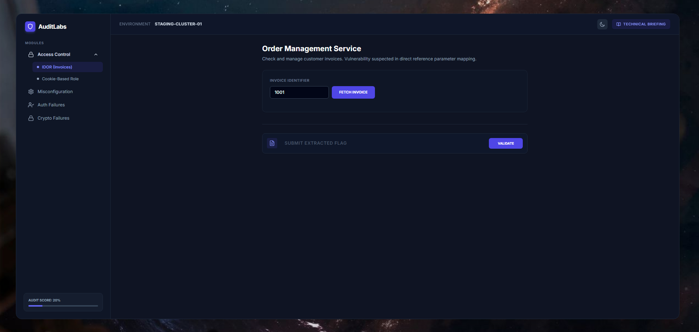

<div align="center">
  
  
  <br><br>

  # 🛡️ AuditLabs
  **Interactive Security Training Dashboard & Vulnerability Lab**

  [](#)
  [](#)
  [](#)
  [](#)
</div>

<br>

## 📖 Overview

**AuditLabs** is an intentionally vulnerable web application disguised as a modern, sleek Cloud SaaS Platform. It is designed to help developers, security enthusiasts, and penetration testers understand common web vulnerabilities in a realistic, context-driven environment.

Instead of traditional "hacker terminal" aesthetics, AuditLabs places the user inside a realistic corporate portal, demonstrating how critical flaws often hide behind clean user interfaces.

---

## 🎯 Vulnerabilities Addressed (The Labs)

The platform features 5 interactive modules mapped to real-world security missteps:

### 1. Broken Access Control
*   **1.1. Insecure Direct Object Reference (IDOR)**
    * **The Scenario:** The Order Management Service fetches client invoices based on an identity context bound to the DOM.
    * **The Flaw:** The backend trusts user-supplied input (`accountId`) without validating if the current session actually owns that ID.
    * **The Attack:** Attackers can manipulate data-attributes in the HTML to extract sensitive invoices belonging to other accounts.
*   **1.2. Privilege Escalation via Cookie Manipulation**
    * **The Scenario:** An Administrative Control Panel that restricts access based on user roles.
    * **The Flaw:** The system determines authorization by reading a plaintext, client-side cookie (`role=user`).
    * **The Attack:** Attackers can use Browser DevTools (F12) to modify the cookie value to `role=admin`, bypassing server-side checks to gain full administrative access.

### 2. Security Misconfiguration
* **The Scenario:** An Internal Service Health dashboard used by administrators.
* **The Flaw:** Improper production configuration leaves debug headers active (`X-Debug-Mode`) and leaks internal maintenance routes via HTTP headers.
* **The Attack:** Attackers analyze response headers to discover hidden diagnostic endpoints and system paths.

### 3. Authentication Failures (Account Enumeration)
* **The Scenario:** An Identity Provider Probe testing login endpoints.
* **The Flaw:** The API returns different HTTP responses or messages depending on whether a username exists in the database.
* **The Attack:** Attackers differentiate between "User not found" and "Incorrect password" to build a list of valid valid usernames for brute-force attacks.

### 4. Broken Session Management (Cryptographic Failure)
* **The Scenario:** Session context sent via custom HTTP Headers.
* **The Flaw:** The application serializes session data using Base64 encoding without cryptographic signatures or integrity checks.
* **The Attack:** Attackers decode the Base64 payload, modify their permissions, re-encode it, and spoof an authorized session.

---

## ✨ Features

- **Modern UI/UX:** Built with Tailwind CSS, featuring a responsive, floating app-window design.
- **Dark / Light Mode:** Fully supported theme toggling.
- **Gamified Progression:** Built-in flag verification system (`FLAG{...}`) that saves progress in the browser's Local Storage.
- **Technical Briefings:** Integrated documentation modal providing:
  - Threat Analysis.
  - Strategic Remediation advice.
  - Secure Coding Patterns with syntax highlighting for **Node.js, Python, Java, and PHP**.

---

## 🚀 Getting Started

### Installation

1. Clone the repository:
   ```bash
   git clone https://github.com/4ybbe/sec-audit-labs.git
   cd sec-audit-labs
   ```

2.  Install dependencies and start the server using Docker:

    docker-compose up

3.  Open your browser and navigate to:

    http://localhost:3000

⚠️ Disclaimer

Educational Purposes Only. This project is deliberately vulnerable and is
intended only for educational purposes, security awareness training, and local
testing.

  - Do NOT deploy this application on a public-facing server or production
    environment.
  - The creator is not responsible for any misuse of the information or code
    provided in this repository.

